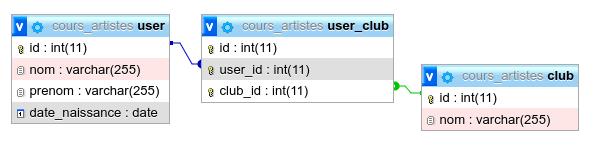

# Exercices les Artistes

Le travail est à réaliser à partir du fichier disponible à l’adresse suivante :
[Artistes.sql](Artistes.sql)

Une fois ce fichier téléchargé, vous l’importerez dans une nouvelle base de données.

---

### Question 1

Lister les clubs auxquels sont inscrits les 'Bob' _(sans doublons)_

### Question 2

Lister les `user` par `club`

### Question 3

Nommer le `club` le plus populaire. _(càd qui a le plus de membres)_

### Question 4

Trouver les `user` qui ne sont inscrit à aucun `club`.

1. En utilisant `EXISTS`

2. En utilisant `JOIN`

### Question 5

Trouver les clubs auxquels ne sont pas inscrit Bob Marley.

### Question 6

Inscrire Bob Marley à tous les clubs en une seule requête.

### Question 7

Virer tous les 'Bob' du club de foot en une seule requête.
