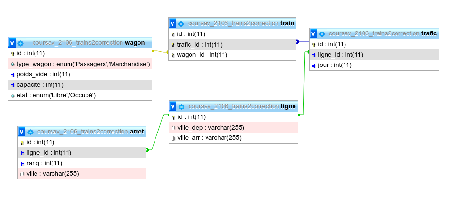

# Exercice Trains 2 - Solutions

## On considère le schéma de base de données suivant :

```
Ligne (NoLigne, VilleDep, VilleArr)
Arret (#NoLigne, Rang, Ville)
Trafic (NoTrain, #NoLigne, NoJour)
Train (#NoTrain, #NoWagon)
Wagon (NoWagon, TypeWagon, PoidsVide, Capacite, Etat)
```

- La relation Ligne donne pour chaque ligne de train la gare de départ et la gare d’arrivée.
- La relation Arret donne le rang et la ville de l’arrêt pour une ligne donnée.
- La relation Trafic associe les trains et les lignes parcourues par ces trains à un numéro de jour de semaine donné (1 pour lundi, 2 pour mardi...). La relation Train liste les wagons qui composent un train.
- La relation Wagon donne les caractéristiques de chaque wagon (l’état peut être "libre" ou "occupé"). Le poids est exprimé en kg.

## Exemple d’instance de base :

- Pour Ligne : {(1,’Lyon’,’Clermont-Ferrand’), (2,’Lyon’, ’Marseille’), ... }
- Pour Arret : {(1,1,’Gannat’), (2,1,’Valence’), (2,2, ’Avignon’), ... }
- Pour Trafic : {(1,1,1),(1,1,2),(1,1,3),(1,1,4), (1,1,5),(2,2,6),(2,2,7), ... }
- Pour Train : {(1,1), (1,3), (1,4), (1,5), (2,9), (2,10), ... }
- Pour Wagon : {(1,’Passagers’, NULL, 150, ’Libre’ ),
  (2,’Marchandise’, 12345, NULL, ’Occupé’ ), ... }



```sql
DROP TABLE IF EXISTS arret;
CREATE TABLE arret (
  id int(11) NOT NULL,
  no_ligne int(11) NOT NULL,
  rang int(11) NOT NULL,
  ville varchar(255) NOT NULL
) ENGINE=InnoDB DEFAULT CHARSET=utf8mb4;

DROP TABLE IF EXISTS ligne;
CREATE TABLE ligne (
  id int(11) NOT NULL,
  no_ligne int(11) NOT NULL,
  ville_dep varchar(255) NOT NULL,
  ville_arr varchar(255) NOT NULL
) ENGINE=InnoDB DEFAULT CHARSET=utf8mb4;

DROP TABLE IF EXISTS trafic;
CREATE TABLE trafic (
  id int(11) NOT NULL,
  no_train int(11) NOT NULL,
  no_ligne int(11) NOT NULL,
  no_jour int(11) NOT NULL
) ENGINE=InnoDB DEFAULT CHARSET=utf8mb4;

DROP TABLE IF EXISTS train;
CREATE TABLE train (
  id int(11) NOT NULL,
  no_train int(11) NOT NULL,
  no_wagon int(11) NOT NULL
) ENGINE=InnoDB DEFAULT CHARSET=utf8mb4;

DROP TABLE IF EXISTS wagon;
CREATE TABLE wagon (
  id int(11) NOT NULL,
  no_wagon int(11) NOT NULL,
  type_wagon enum('Passagers','Marchandise') NOT NULL,
  poids_vide int(11) DEFAULT NULL,
  capacite int(11) DEFAULT NULL,
  etat enum('Libre','Occupé') NOT NULL
) ENGINE=InnoDB DEFAULT CHARSET=utf8mb4;


ALTER TABLE arret
  ADD PRIMARY KEY (id),
  ADD UNIQUE KEY rang (rang,no_ligne),
  ADD KEY ligne_id (no_ligne);

ALTER TABLE ligne
  ADD PRIMARY KEY (id),
  ADD UNIQUE KEY no_ligne (no_ligne);

ALTER TABLE trafic
  ADD PRIMARY KEY (id),
  ADD KEY ligne_id (no_ligne),
  ADD KEY no_train (no_train);

ALTER TABLE train
  ADD PRIMARY KEY (id),
  ADD KEY fk_train_no_train (no_train),
  ADD KEY fk_train_no_wagon (no_wagon);

ALTER TABLE wagon
  ADD PRIMARY KEY (id),
  ADD UNIQUE KEY no_wagon (no_wagon);


ALTER TABLE arret
  MODIFY id int(11) NOT NULL AUTO_INCREMENT;

ALTER TABLE ligne
  MODIFY id int(11) NOT NULL AUTO_INCREMENT;

ALTER TABLE trafic
  MODIFY id int(11) NOT NULL AUTO_INCREMENT;

ALTER TABLE train
  MODIFY id int(11) NOT NULL AUTO_INCREMENT;

ALTER TABLE wagon
  MODIFY id int(11) NOT NULL AUTO_INCREMENT;


ALTER TABLE arret
  ADD CONSTRAINT fk_arret_no_ligne FOREIGN KEY (no_ligne) REFERENCES ligne (no_ligne) ON DELETE CASCADE ON UPDATE CASCADE;

ALTER TABLE trafic
  ADD CONSTRAINT trafic_ibfk_1 FOREIGN KEY (no_ligne) REFERENCES ligne (no_ligne) ON DELETE CASCADE ON UPDATE CASCADE;

ALTER TABLE train
  ADD CONSTRAINT fk_train_no_train FOREIGN KEY (no_train) REFERENCES trafic (no_train),
  ADD CONSTRAINT fk_train_no_wagon FOREIGN KEY (no_wagon) REFERENCES wagon (no_wagon) ON DELETE CASCADE ON UPDATE CASCADE;
;

```

Data

```sql

INSERT INTO `ligne` (`no_ligne`, `ville_dep`, `ville_arr`) VALUES
(1, 'Lyon', 'Clermont-Ferrand'),
(2, 'Lyon', 'Marseille');

INSERT INTO `arret` (`no_ligne`, `rang`, `ville`) VALUES
(1, 1, 'Gannat'),
(2, 1, 'Valence'),
(2, 2, 'Avignon');

INSERT INTO `wagon` (`no_wagon`, `type_wagon`, `poids_vide`, `capacite`, `etat`) VALUES
(1, 'Passagers', NULL, 150, 'Libre'),
(2, 'Marchandise', 12345, NULL, 'Occupé'),
(3, 'Passagers', NULL, 150, 'Libre'),
(4, 'Marchandise', 12345, NULL, 'Occupé'),
(5, 'Passagers', NULL, 150, 'Libre'),
(6, 'Marchandise', 12345, NULL, 'Occupé'),
(7, 'Passagers', NULL, 150, 'Libre'),
(8, 'Marchandise', 12345, NULL, 'Occupé'),
(9, 'Passagers', NULL, 150, 'Libre'),
(10, 'Marchandise', 12345, NULL, 'Occupé');

INSERT INTO `train` (`no_train`, `no_wagon`) VALUES
(1, 1),
(1, 3),
(1, 4),
(1, 5),
(2, 9),
(2, 10);

INSERT INTO `trafic` (`no_train`, `no_ligne`, `no_jour`) VALUES
(1, 1, 1),
(1, 1, 2),
(1, 1, 3),
(1, 1, 4),
(1, 1, 5),
(2, 2, 6),
(2, 2, 7);
```

## Donner les requêtes SQL permettant de répondre aux questions suivantes :

1. Donner la liste des gares traversées par la ligne 3. Le résultat sera renommé ’GareTraverseeParL3’ et sera trié selon le rang de l’arrêt.

```sql
SELECT ville AS GareTraverseeParL3
FROM arret
WHERE no_ligne = 3
ORDER BY rang;
```

```sql
-- ligne 2
SELECT ville AS GareTraverseeParL2
FROM arret
WHERE no_ligne = 2
ORDER BY rang;

+--------------------+
| GareTraverseeParL2 |
+--------------------+
| Valence            |
| Avignon            |
+--------------------+
```

2. Donner les numéros des wagons faisant à vide entre 800kg et 2tonnes et de type ’Marchandise’.

```sql
SELECT no_wagon
FROM wagon
WHERE
  poids_vide BETWEEN 800 AND 2000
  AND type_wagon = 'Marchandise';
```

3. Donner les wagons dont on ne connaît pas soit le poids à vide soit la capacité.

```sql
SELECT no_wagon
FROM wagon
WHERE
  poids_vide IS NULL
  OR capacite IS NULL;
```

4. Donner les numéros des lignes partant de Lyon et pour lesquelles au moins un train circule le mercredi.

```sql
SELECT L.no_ligne
FROM
  trafic AS T
  JOIN ligne L ON T.no_ligne = L.no_ligne
WHERE
  T.no_jour = 3
  AND L.ville_dep = 'Lyon';
```

5. Donner les wagons de type ’Marchandise’ de capacité inférieure strictement à celle du wagon 12.

```sql
SELECT W1.*
FROM
  wagon AS W1
  JOIN wagon W2 ON W1.capacite < W2.capacite
WHERE
  W1.type_wagon = 'Marchandise'
  AND W2.no_wagon = 12;
```

6. Donner les couples de numéros de wagons qui sont libres, de même type, de même poids à vide mais de capacités différentes.

```sql
SELECT W1.no_wagon , W2.no_wagon
FROM
  wagon W1
  JOIN wagon W2 ON (
    W1.type_wagon = W2.type_wagon
    AND W1.poids_vide = W2.poids_vide
    AND W1.capacite < W2.capacite
  )
WHERE
  W1.etat = 'libre'
  AND W2.etat = 'libre';
```

7. Donner le numéro des trains qui sont composés d’au moins deux wagons de type ’Passagers’ et qui partent de ’Dijon’ ou arrivent à ’Valence’.

```sql
SELECT T.no_train
FROM train T
  JOIN wagon W1 ON T.no_wagon = W1.no_wagon
  JOIN wagon W2 ON (
    T.no_wagon = W2.no_wagon
    AND W1.no_wagon != W2.no_wagon
  )
  JOIN trafic Tr ON Tr.no_train = T.no_train
  JOIN ligne L ON Tr.no_ligne = L.no_ligne
WHERE
  W1.type_wagon = 'Passagers'
  AND W2.type_wagon = 'Passagers'
  AND (
    L.ville_dep = 'Dijon'
    OR L.ville_arr = 'Valence'
  );
```
